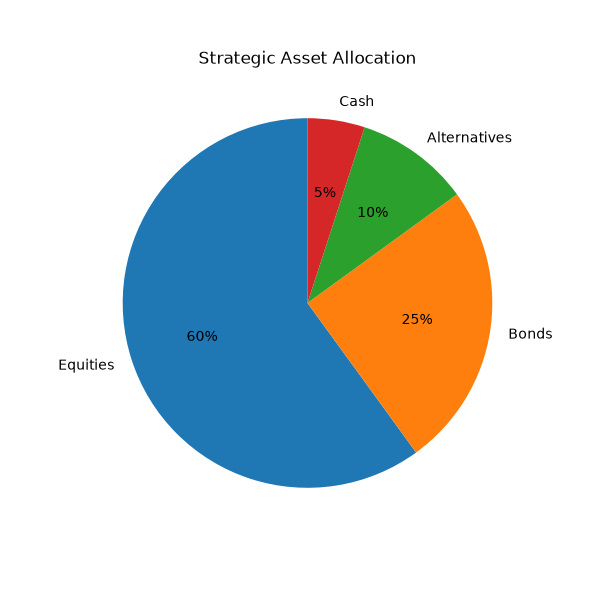

# Investment Proposal Generator



Professional Python toolkit for Portfolio Construction, Strategic Asset Allocation, Stress Testing and Investment Proposal Generation.

---

## Overview

This project reproduces the workflow of an Investment Proposal Specialist working in Private Banking or Wealth Management.

The application allows an advisor to:

- Build a strategic portfolio allocation
- Perform portfolio rebalancing
- Execute custom stress tests
- Evaluate portfolio risk
- Generate investment recommendations
- Produce a professional PDF investment proposal

---

## Features

- Strategic Asset Allocation
- Portfolio Rebalancing
- Multi-Scenario Stress Testing
- Risk Classification
- Recommendation Engine
- Portfolio Visualization
- Automated PDF Report Generation

---

## Project Structure

```text
investment-proposal-generator/

├── src/
│   ├── main.py
│   ├── client.py
│   ├── portfolio.py
│   ├── stress_testing.py
│   ├── scenario_analysis.py
│   ├── visualization.py
│   └── reporting.py
│
├── reports/
│   └── Investment_Proposal.pdf
│
├── images/
│   └── allocation_chart.png
│
├── archive/
│
├── requirements.txt
├── LICENSE
└── README.md
```

---

## Technologies

- Python
- ReportLab
- Matplotlib
- Git
- GitHub

---

## Skills Demonstrated

- Portfolio Construction
- Strategic Asset Allocation
- Portfolio Rebalancing
- Stress Testing
- Financial Risk Analysis
- Python Programming
- Data Visualization
- Automated Reporting

---

## Target Roles

This project has been developed for roles including:

- Investment Proposal Specialist
- Portfolio Analyst
- Investment Analyst
- Wealth Management Analyst
- Private Banking Investment Specialist

---

## Author

**Joshua Atomo**

Python • Portfolio Analytics • Investment Solutions
